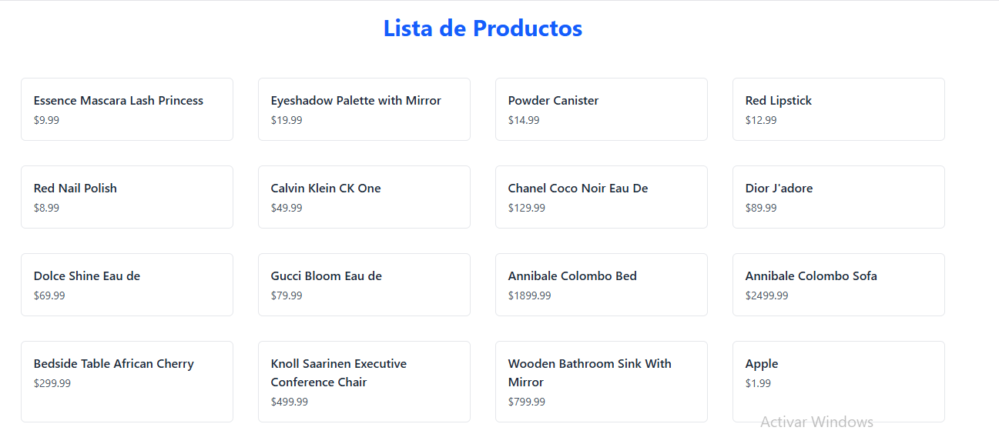
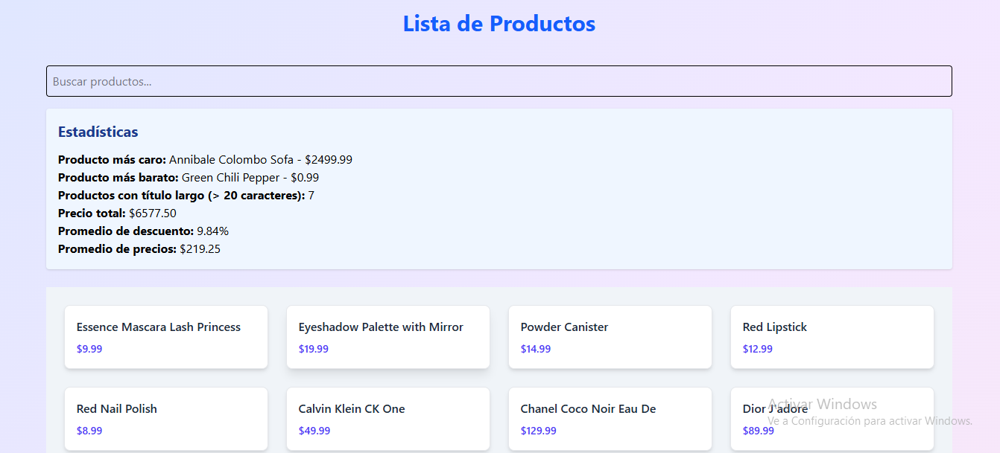

#Instrucciones para ejecutar el proyecto primera parte EV1
Para ejecutar este proyecto, primero se debe clonar el repositorio en tu computadora. Luego, abrís la carpeta del proyecto con tu editor de código (por ejemplo, Visual Studio Code). Una vez dentro, abrís una terminal y ejecutás el comando npm install para instalar todas las dependencias necesarias.

Cuando termine la instalación, ejecutás el comando npm run dev para iniciar el servidor de desarrollo. Después, abrís un navegador web y accedés a la dirección que se muestra en la terminal, que generalmente es http://localhost:5175.

Una vez hecho esto, vas a poder ver en pantalla la lista de productos cargados desde la API, con sus respectivos títulos y precios, y presentados con estilos aplicados usando Tailwind CSS.

#Descripción del proyecto
Se utiliza Axios para hacer una solicitud GET a la API de DummyJSON.

La respuesta se almacena en el estado del componente.

Se muestran los productos en pantalla, incluyendo su título y precio.

Se aplican clases de Tailwind CSS para mejorar el diseño.

El componente principal es Productos.jsx, que se importa y usa en App.jsx.

